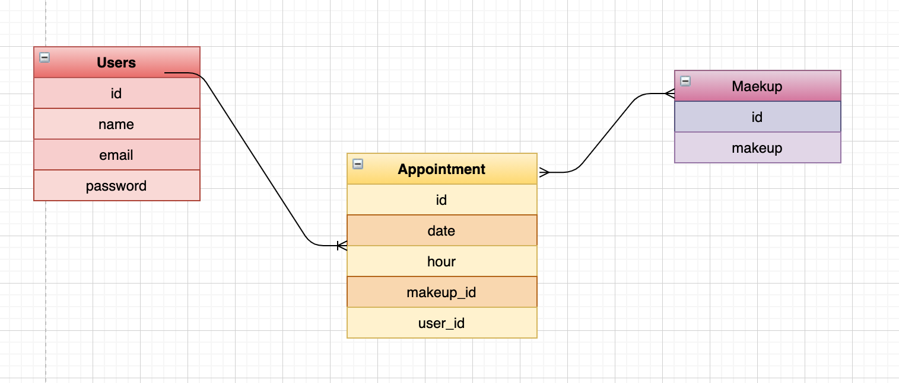
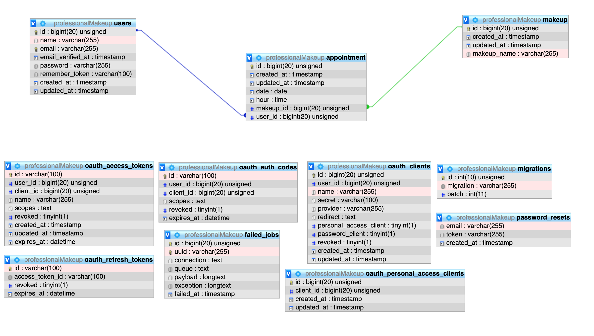

## ProfessionalMakeupBack
Este proyecto es el back end para la parte front end de una agencia de maquillaje (ProfessionalMakeupFrontEnd), consiste en una API donde el usuario se puede loguear, registrar, pedir/eliminar cita.
#### · Tecnologías:
Para realizar este proyecto he utilizado las siguientes tecnologías:
· PHP
· Laravel
· phpmyadmin
· Namp

#### · BBDD:
Planteamiento inicial de la base de datos antes de empezar el proyecto con Laravel:

Después migrando las tablas con Laravel a phpmyadmin:

#### · Rutas con Postman:
· http://127.0.0.1:8000/api/auth/signup -> Crear cuenta
· http://127.0.0.1:8000/api/auth/login -> Login
· http://127.0.0.1:8000/api/auth/logout -> Logout
· http://127.0.0.1:8000/api/auth/user/{email} -> Sacar datos de usuario
· http://127.0.0.1:8000/api/auth/appointment -> Crear cita
· http://127.0.0.1:8000/api/auth/deleteAppointment/{id} -> Eliminar cita
· http://127.0.0.1:8000/api/auth/profile/{id} -> Sacar datos para el perfil
#### · Autor: 
Paula Martín Sánchez